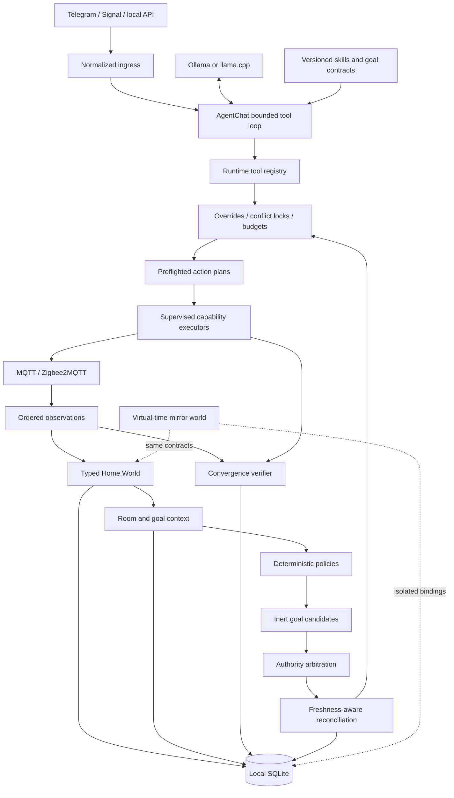

# Zaik

**A local-first, continuously reasoning house agent built on the BEAM.**

Zaik combines Elixir/OTP, local language models, typed home state, deterministic safety boundaries, and a replayable mirror world. It is designed to understand household intent without handing an LLM unrestricted access to devices—or sending the household's private history to a cloud agent.

```text
Observe -> derive context -> generate goals -> arbitrate -> reconcile -> execute -> verify
```

Zaik is not a collection of prompt-triggered routines. It is an agent harness where models propose semantic goals and typed plans, while Elixir owns identity, permissions, evidence, priorities, execution, verification, retries, and rollout policy.

> [!IMPORTANT]
> Zaik is experimental. Explicit, validated user actions can control configured devices. Continuous autonomy currently runs only in `shadow` or `advisory` mode; physical `canary` and `active` modes are deliberately rejected until promotion and rollback gates are complete.

## What makes Zaik different?

- **Local-first by construction** — local LLM providers, SQLite telemetry, filesystem session memory, and local MQTT.
- **One house brain** — Telegram and optional Signal ingress normalize into one bounded `Zaik.AgentChat` tool loop.
- **Typed world model** — models see entities, capabilities, room context, history, occupancy, modes, presets, and evidence—not raw MQTT topics.
- **Deterministic control plane** — Elixir validates every target, preset, policy, permission, risk ceiling, and evidence fingerprint.
- **Physical verification** — broker acceptance is not physical success. Actions remain `accepted` until canonical device reports prove convergence.
- **Continuous but conservative** — event-driven policies produce inert desired states; arbitration, overrides, freshness, hysteresis, locks, and budgets decide what remains actionable.
- **A temporal mirror world** — production contracts run against isolated production-schema SQLite databases, virtual time, deterministic devices, and injected faults without publishing production MQTT.
- **Hot-load-friendly extension points** — tools, capabilities, executors, and policies are discovered at runtime rather than cached as module code.

## Architecture



The production and mirror worlds share capability, policy, plan, verifier, ledger, preset, retry, arbitration, budget, conflict-lock, and SQL semantics. Only their bindings differ: production uses real observations and configured executors; mirror runs use temporary databases and virtual devices.

See [`docs/architecture.md`](docs/architecture.md), [`docs/module-map.md`](docs/module-map.md), and the active [`home brain roadmap`](docs/zaik-home-brain-roadmap.md).

## Why Elixir and OTP?

A house agent is a long-running distributed system, even when it lives on one machine. Sensors disconnect, brokers restart, models time out, messages arrive twice, and physical devices report late or out of order. OTP is the runtime architecture, not just the implementation language:

- **Supervisors** isolate chat polling, MQTT, stores, policy evaluation, and action execution.
- **Dynamic supervisors** run bounded task and tool workers without leaking processes.
- **GenServers** serialize mutable coordination state such as queues, device observations, occupancy, and verification.
- **Process monitors** remove dead subscribers and reconcile worker termination without process scanning.
- **Message passing and timers** implement debounce, cooldown, settle windows, verification deadlines, and virtual time.
- **Temporary action workers** prevent supervisor restarts from blindly replaying physical side effects.
- **Durable ledgers** decide semantic recovery: idempotency, retry eligibility, action status, desired-state leases, budgets, and operator decisions survive process lifetimes.

The BEAM restores processes. Zaik's ledgers decide whether work is still safe to perform.

## The safety boundary

The model may choose:

- a semantic goal;
- a registered tool;
- a known entity and capability;
- a typed target or named preset;
- references to evidence gathered by Zaik.

The model may **not** choose:

- MQTT topics or arbitrary adapter payloads;
- unrestricted predicates or SQL;
- household authority weights;
- fabricated device observations;
- retry targets reconstructed from prose;
- whether broker acceptance counts as physical completion.

Key invariants include:

1. Coordinated plans are completely preflighted before the first side effect.
2. Versioned goals must carry an exact evidence fingerprint rebuilt immediately before execution.
3. Stale and duplicate reports cannot regress state, create history, trigger autonomy, or verify actions.
4. Equivalent pending actions are suppressed; contradictory pending targets are blocked.
5. Explicit user actions create temporary override leases that background policy cannot immediately undo.
6. Authority is fixed in code:

   ```text
   safety/security       100
   explicit user          90
   privacy/sleep          80
   comfort                60
   daylight/energy        40
   ```

7. Confidence breaks ties only inside the same authority class.
8. Autonomous action budgets are durable and assessed per device, room, and home.
9. Model fallback never replays an attempted side effect.
10. Any action carrying an autonomy decision identity is rejected at the generic tool executor; shadow/advisory output cannot cross into physical execution.
11. `accepted` means transport accepted the command; `verified` means later canonical state converged.

## Current capabilities

### Agent runtime

- Supervised task queue, dispatcher, retries, cancellation, timeouts, and watchdog reconciliation.
- Filesystem-backed JSONL sessions under `~/.zaik/sessions`.
- SQLite operational telemetry in `~/.zaik/zaik.db`.
- Provider-neutral local LLM facade for Ollama and llama.cpp/`llama-server`.
- Telegram-first normalized chat ingress with optional locally disabled Signal support.
- Read-only bounded SQL over documented operational and home views.

### Typed home runtime

- MQTT/Zigbee2MQTT ingestion with source-time ordering and restart bootstrap.
- Canonical temperature, humidity, illuminance, presence, cover, battery, and link-quality capabilities.
- Generic device presets stored as typed capability targets.
- Preflighted multi-device plans and structured partial completion.
- An inert staged-plan contract that fully preflights every stage, typed canonical-state condition, bounded observation wait, and deadline without executing or sleeping.
- Durable staged-plan lifecycle storage with virtual-time expiry, exact-ID operator cancellation, restart recovery, and bounded terminal retention.
- A supervised, ledger-protected staged coordinator available only with isolated mirror bindings; virtual-time and dependency-filtered canonical-observation wakeups recover or advance durable waits without busy polling, while a bounded SQLite run journal and read-only watchdog expose missed wakeups, stuck evaluations, repeated failures, timeouts, exits, and terminal outcomes.
- Persistent request-scoped idempotency and policy-gated retries.
- MQTT-backed action convergence verification.
- Derived room context with occupancy, freshness, history summaries, season, and sunrise/sunset solar phase.
- Versioned goal contracts with independently gathered evidence.

### Continuous home brain

- Debounced multi-sensor occupancy projection with durable meaningful transitions and advisory, non-identifying cross-area entry sequences.
- Durable manual overrides, desired-state leases, and typed bedtime/privacy modes.
- Deterministic daylight harvesting, solar-heat avoidance, and bedtime/privacy policies.
- Fixed-authority arbitration and freshness-aware reconciliation.
- Policy-defined hysteresis, minimum-active, settle, and cooldown windows.
- Pending-action conflict locks and sliding-window action budgets.
- Durable decision traces, execution outcomes, and rated operator feedback.
- Audited whole-home, per-room, per-policy, and room-policy `off | shadow | advisory` rollout controls with deterministic precedence.
- Supervised, concurrency-bounded policy workers with durable timeout diagnostics.
- Production shadow evaluation that reads live observations but cannot publish autonomous commands.

### Evaluation harness

- Contract and integration tests.
- Deterministic routing and SQL-quality evals.
- Temporal mirror scenarios with virtual time and injected delays, stale reports, conflicts, failures, non-convergence, expiry, budgets, and overrides.
- Isolated live-model evals over temporary production-schema databases.
- Privacy-filtered production replay and deterministic candidate gates.

## Quick start

### Requirements

The development environment is defined by `flake.nix` and includes Elixir, Erlang, SQLite, and Mosquitto tools.

```bash
git clone https://github.com/debussyman/zaik.git
cd zaik
nix develop
mix test
```

Run Zaik in the foreground:

```bash
nix develop -c mix run --no-halt
```

Inspect health:

```bash
nix develop -c mix run -e 'IO.inspect(Zaik.health())'
```

## Configuration

Runtime secrets and household calibration belong in private environment files, never in Git. Example files live under [`examples/env`](examples/env).

A user-level service can load:

```text
~/.config/zaik/home.env
~/.config/zaik/telegram.env
~/.config/zaik/signal.env
```

Keep them private:

```bash
chmod 600 ~/.config/zaik/*.env
```

### Home and MQTT

```sh
ZAIK_MQTT_ENABLED=true
ZAIK_MQTT_HOST=localhost
ZAIK_MQTT_PORT=1883
ZAIK_ZIGBEE2MQTT_DATA_DIR=$HOME/.local/share/zigbee2mqtt/data
ZAIK_HOME_HISTORY_DB=$HOME/.zaik/home/home.db
```

Optional location calibration enables deterministic sunrise/sunset context. Approximate coordinates are sufficient:

```sh
ZAIK_HOME_TIMEZONE=America/New_York
ZAIK_HOME_LOCATION_NAME=Home
ZAIK_HOME_LATITUDE=40.71
ZAIK_HOME_LONGITUDE=-74.01
```

When `ZAIK_HOME_UTC_OFFSET_MINUTES` is omitted, production uses the host's current local UTC offset. The host timezone should therefore match `ZAIK_HOME_TIMEZONE`.

### Telegram

```sh
ZAIK_TELEGRAM_ENABLED=true
ZAIK_TELEGRAM_BOT_TOKEN=replace-me
ZAIK_TELEGRAM_BOT_USERNAME=your_bot_username
ZAIK_TELEGRAM_ALLOWED_USER_IDS=111111111,222222222
ZAIK_TELEGRAM_ALLOWED_CHAT_IDS=
ZAIK_TELEGRAM_REQUIRE_DIRECT_ADDRESSING=false
```

Allowlisted groups default to ambient mode unless another account is mentioned. Private conversations do not require an addressing prefix.

### Local models

Ollama and llama.cpp are supported behind `Zaik.LLM.Provider`:

```sh
ZAIK_LLM_PROVIDER=llama_cpp
ZAIK_LLAMA_CPP_URL=http://127.0.0.1:8080
ZAIK_LLM_MODEL=qwen3-coder:30b
ZAIK_AGENT_MODEL=qwen3:4b-instruct
ZAIK_AGENT_FALLBACK_MODEL=qwen3.8:27b
```

Model output remains untrusted regardless of provider or size.

## Public API examples

```elixir
# Tasks and health
{:ok, task_id} = Zaik.submit_task(:echo, %{message: "hello"})
{:ok, result} = Zaik.await_task(task_id)
Zaik.health()
Zaik.watchdog_scan()

# One conversational house brain
Zaik.agent_chat("Is the nursery cooling off?", %{channel: :telegram})

# Canonical home state and action lifecycle
Zaik.home_devices()
Zaik.home_action_status(action_id)
Zaik.home_action_retry_eligibility(action_id)
Zaik.retry_home_action(action_id)

# Goal evidence and autonomy inspection
Zaik.home_goal_context("bedtime")
Zaik.home_desired_states("nursery")
Zaik.home_action_budget_status(:global)

# Explicit operator controls; physical autonomy modes are rejected
Zaik.pause_home_autonomy("maintenance", "operator")
Zaik.set_home_autonomy_mode(:shadow, "operator")
Zaik.set_home_autonomy_scope_mode("nursery", :advisory, %{
  policy_id: "daylight_harvesting",
  changed_by: "operator",
  reason: "room-level shadow review"
})
Zaik.home_autonomy_scope_modes("nursery")
Zaik.resume_home_autonomy("operator")
```

Normal reads should use typed tools such as `get_home_state`, `get_home_history`, `get_area_context`, and `get_home_goal_context`. Raw SQL is reserved for bounded aggregation and is validated as read-only against allowlisted views.

## Extending Zaik

Core extension points are behaviours backed by uncached runtime registries:

- `Zaik.Tool` — read and action tools.
- `Zaik.Home.Capability` — canonical state and target validation.
- `Zaik.Home.Executor` — adapter execution of validated targets.
- `Zaik.Home.Policy` — immutable context to inert goal candidates.
- `Zaik.LLM.Provider` — local model providers.
- `Zaik.MQTT.Handler` — transport fanout consumers.

Registries retain module identities, not cached function implementations, preserving normal BEAM hot-code loading semantics.

New autonomy behavior is incomplete unless the same change adds temporal mirror coverage and observable safety assertions.

## Evaluation

```bash
# Full deterministic test suite
nix develop -c mix test

# Routing and SQL guards; no model and no MQTT publication
nix develop -c mix zaik.routing_eval

# Virtual-time home behavior with isolated SQLite and no production MQTT
nix develop -c mix zaik.mirror_eval

# Live local-model reads against isolated fixtures
nix develop -c mix zaik.agent_eval --timeout-ms 120000

# Live-model planning with virtual execution only
nix develop -c mix zaik.agent_eval --include-home-control --timeout-ms 120000
```

Evals assert semantic outcomes and safety invariants—not hidden reasoning or exact prose.

## Local data

```text
~/.zaik/sessions/        inspectable JSONL conversation memory
~/.zaik/zaik.db          task, session, message, LLM, and proposal telemetry
~/.zaik/home/home.db     observations, identity, presets, actions, decisions,
                         modes, overrides, desired states, budgets, and feedback
```

Zaik's default architecture keeps household state on the operator's machine. Sanitization is required before turning production failures into replay fixtures or training examples.

## Project status and roadmap

The project is being developed in reversible safety slices:

1. stable typed contracts and calibration;
2. derived household context;
3. declarative goals and policies;
4. arbitration and reconciliation;
5. supervised shadow autonomy and durable decisions;
6. staged causal plans;
7. generated temporal evaluation and replay;
8. tightly gated canary promotion and rollback;
9. broader capabilities such as lighting;
10. preference learning and safe extension.

See [`docs/zaik-home-brain-roadmap.md`](docs/zaik-home-brain-roadmap.md) for the detailed milestones. Continuous physical autonomy remains intentionally disabled.

## Contributing

Read [`CONTRIBUTING.md`](CONTRIBUTING.md) and [`docs/module-map.md`](docs/module-map.md) before changing boundaries. Preserve the stable `Zaik` facade, keep physical side effects behind supervised validated executors, and include mirror coverage for new temporal behavior.

Zaik is licensed under the [MIT License](LICENSE).
